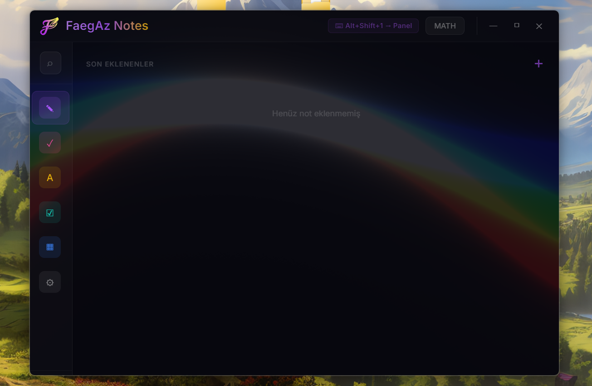

# FaegAz Notes

<div align="center">


**[🇹🇷 Türkçe için aşağı kaydır](#türkçe)**

</div>

---

## English

A modern, minimalist Windows desktop app for notes, tasks, habits, vocabulary and OCR.

### Screenshots

<!-- Ana pencere -->


<!-- OCR seçimi -->


### Features

- **Notes** — Quick note-taking with inline editing and auto-math (`3+5=` → `8`)
- **Tasks** — To-do list with completion tracking
- **Words** — Vocabulary cards with automatic translation
- **Calendar** — Monthly view with day-based events and notifications
- **Habit Tracker** — Daily habit grid
- **Floating Panel** — Always-on-top panel accessible anywhere via `Alt+Shift+1`, stays on top of fullscreen games
- **OCR** — Select text from screen → auto-recognize and translate *(Python required)*
- **Settings** — Manage OCR languages, download additional language models

### Installation

#### Ready EXE (Recommended)

1. Download the latest release
2. Run `FaegAz Notes 1.0.0.exe`

> If Windows shows an "Unknown Publisher" warning, click **Run anyway**.

#### From Source

```bash
npm install
npm start         # run in dev mode
npm run build     # build EXE to dist/
```

**Requirements:** Node.js 18+

#### OCR Feature (Optional)

```bash
pip install easyocr pillow numpy
```

Translation is handled by MyMemory API (internet required, auto language detection). Additional OCR language models can be downloaded from the Settings page inside the app.

### Tech Stack

| | |
|---|---|
| Framework | Electron 33 |
| Database | SQLite (sql.js) |
| OCR | EasyOCR (Python) |
| Translation | MyMemory API |
| UI | Vanilla HTML/CSS/JS |

### License

MIT — Türker Yağız Odabaş

---

## Türkçe

Windows için modern, minimalist bir masaüstü not uygulaması. Not alma, görev takibi, alışkanlıklar, kelime kartları ve OCR özellikleriyle gelir.


### Özellikler

- **Notlar** — Hızlı not alma, inline düzenleme, otomatik matematik (`3+5=` → `8`)
- **Görevler** — Yapılacaklar listesi, tamamlama takibi
- **Kelimeler** — Otomatik çeviri ile kelime kartları
- **Takvim** — Aylık görünüm, gün bazında etkinlik ve bildirim
- **Alışkanlık Takibi** — Günlük alışkanlık çizelgesi
- **Floating Panel** — `Alt+Shift+1` kısayoluyla her yerden erişilebilen şeffaf panel, tam ekran oyunların üstünde kalır
- **OCR** — Ekrandan bölge seç → otomatik metin tanıma ve çeviri *(Python gerektirir)*
- **Ayarlar** — OCR dil yönetimi, ek dil modeli indirme

### Kurulum

#### Hazır EXE (Önerilen)

1. Son sürümü indir
2. `FaegAz Notes 1.0.0.exe` dosyasını çalıştır

> Windows "Bilinmeyen Yayıncı" uyarısı verirse **"Yine de çalıştır"** seçeneğini seç.

#### Kaynak Koddan

```bash
npm install
npm start         # geliştirme modunda çalıştır
npm run build     # dist/ klasörüne EXE üret
```

**Gereksinim:** Node.js 18+

#### OCR Özelliği (Opsiyonel)

```bash
pip install easyocr pillow numpy
```

Çeviri için MyMemory API kullanılır (internet gerekir, otomatik dil algılama). Ek OCR dil modelleri uygulama içindeki Ayarlar sayfasından indirilebilir.

### Teknolojiler

| | |
|---|---|
| Çerçeve | Electron 33 |
| Veritabanı | SQLite (sql.js) |
| OCR | EasyOCR (Python) |
| Çeviri | MyMemory API |
| UI | Vanilla HTML/CSS/JS |

### Lisans

MIT — Türker Yağız Odabaş
